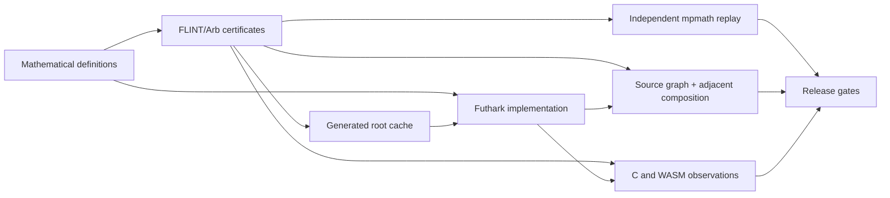

# futhark-bessel

Provenance-clean `J0`, `J1`, and positive `J1` roots for Futhark.

> [!IMPORTANT]
> This package is pre-release. Its API is not stable, and no release accuracy
> envelopes are declared yet. [RELEASE.md](RELEASE.md) tracks the open gates.

## Use

From a checkout, the package uses the official Futhark package path:

```futhark
import "lib/github.com/Jesssullivan/futhark-bessel/bessel"

let checked = f32_bessel.j0_checked 12.0f32
let root = f64_bessel.positive_j1_root 1
```

`bessel.fut` exports both `f32_bessel` and `f64_bessel`. Checked evaluation
distinguishes finite results, out-of-domain inputs, and nonfinite inputs on
`|x| <= 1024`; cached and recomputed roots accept indices `1..256`.

## Verification model



The proof and test layers deliberately make different claims:

| Layer | Main recipe | Scope |
| --- | --- | --- |
| Exact-real approximation | `just approximation-proof` | Series, Hankel, switches, and reduction cells/ties |
| Written floating-point graph | `just floating-point-analysis` | Source-operation rounding model and adjacent transition-band composition |
| Recomputing root solver | `just root-solver-proof` and `just solver-root-envelope-proof` | Source arithmetic plus mathematical root error and residual |
| Cached roots | `just root-envelope-proof` | Correct rounding and mathematical residuals for indices 1–256 |
| Runtime observations | `just backend-conformance` and `just observed-envelopes` | Finite-sample C/WASM regression evidence |

These boundaries are intentional:

- Exact-real and source-graph proofs do not certify backend lowering,
  contraction, or reassociation.
- Finite-sample observations are regression tripwires, not whole-domain release
  envelopes.
- WebGPU is compile-checked only; runtime conformance remains open.
- The checked-in root table is a reproducible cache, not numerical authority.
- `positive_j1_root_solved` is a recomputation path, not the certified cache.
  Its current source-graph and mathematical-root bounds live in
  [`solver-root-envelopes.json`](evidence/solver-root-envelopes.json); backend
  containment and reported-residual accuracy remain uncertified.

Machine-readable evidence lives in [`evidence/`](evidence/). Method provenance
is summarized in [`evidence/provenance.json`](evidence/provenance.json).
Selected proof summaries bind their certificate ledgers, implementation, and
verifiers. Release gates and remaining blockers live in [RELEASE.md](RELEASE.md).

## Reproduce

Run the pinned repository gate:

```sh
nix develop --command just check
```

`nix develop --command just release-preflight` stays fail-closed until every
release gate has evidence. Use `nix develop --command just --list` for focused
proof and test recipes.

Development is tracked under Wavegen TIN-3715. Licensed under the
[ISC License](LICENSE).
